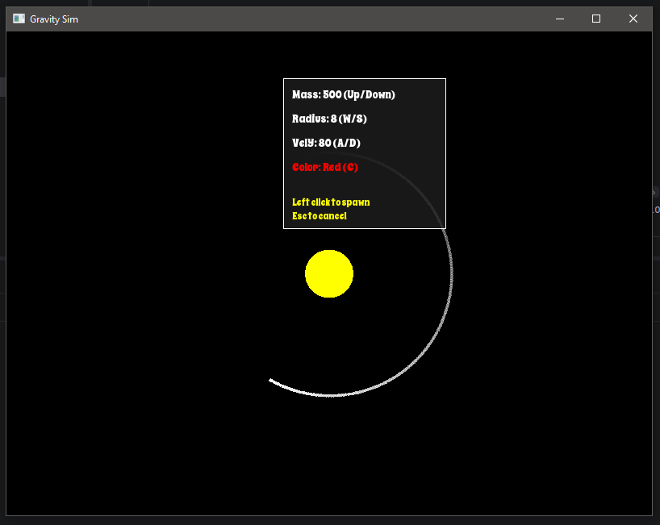

# Gravity Simulator

A real-time 2D gravity simulation built with C++ and SFML. Spawn planets, watch them orbit, crash, and fling each other across space.

## Demo


## Features
- Realistic gravitational physics between all bodies
- Stable orbital integration (Symplectic Euler)
- Orbital trails that fade over time
- Spawn menu to customize each planet before placing it

## Controls
| Input | Action |
|-------|--------|
| Right Click | Open spawn menu at cursor |
| Left Click | Spawn planet |
| Up / Down | Increase / decrease mass |
| W / S | Increase / decrease radius |
| A / D | Adjust initial velocity |
| C | Cycle planet color |
| Esc | Close menu / exit |

## Built With
- C++17
- SFML 2.6.1

## Building
```bash
mkdir build && cd build
cmake ..
cmake --build .
```

Make sure SFML is installed and the path is set correctly in CMakeLists.txt.

## What I Learned
- Implementing Newtonian gravity between multiple bodies
- Real-time physics simulation in C++
- Managing entity systems with a manager class pattern